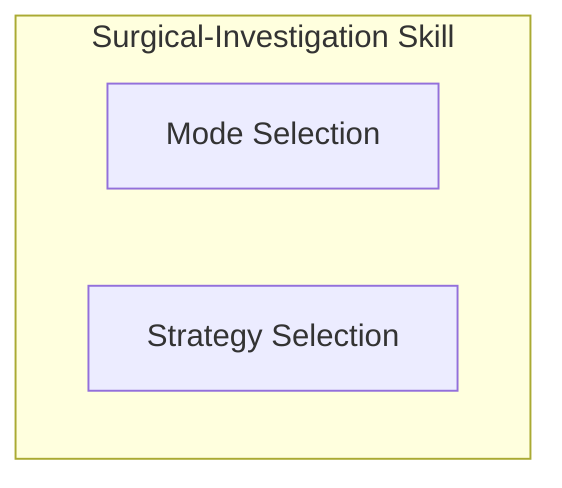
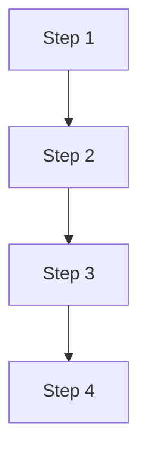
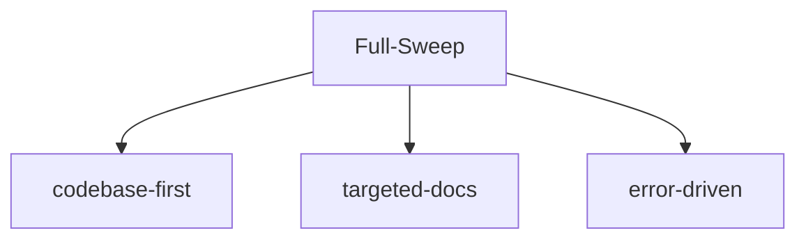
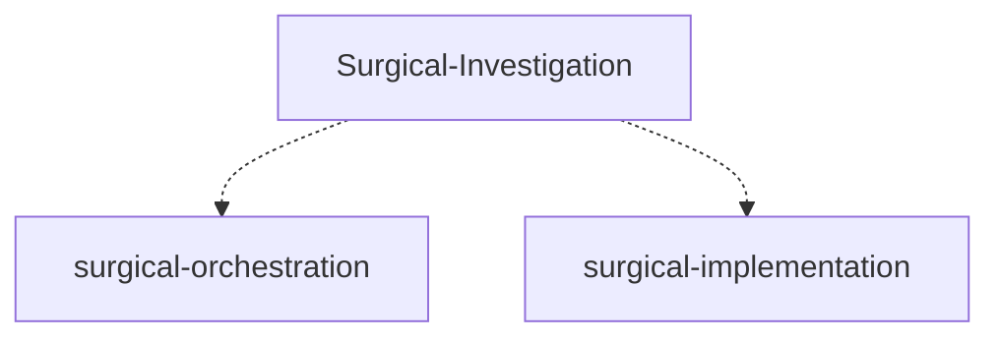

# Mermaid Best Practices — Reference

Used when generating diagrams for surgical-investigation reports (Step 8a, HTML output).

## Size Limits

- Keep diagrams under **50 nodes** — larger diagrams become unreadable in HTML
- Use **subgraphs** to group related nodes
- Break very large systems into multiple diagrams (Backend, Frontend, Research, Entire — separate diagrams)

## Naming

- Use consistent naming: `S1`, `S2` for steps; descriptive names for concepts (`DependencyAudit`, `BestPractices`)
- Avoid spaces in node IDs — use CamelCase or underscore
- Label nodes clearly: `S1["Step 1: Scope Definition"]`

## Subgraph Usage

Group by concern:

This improves readability and keeps the Entire-Project diagram manageable.

## Edge Styles

| Style | Use |
|-------|-----|
| `-->` (default) | Normal flow |
| `-.->` | Optional/dependent flow |
| `==>` | Strong dependency |
| `-.->|with label` | Labeled dependency |

## Color Coding

Use fill colors for categories (optional but recommended):
- Skill steps: `fill:#f9f,stroke:#333` (pink/purple)
- References: `fill:#bbf,stroke:#333` (blue)
- Output formats: `fill:#bfb,stroke:#333` (green)
- External skills: `fill:#fbf,stroke:#333` (light purple)

## Common Patterns for This Skill

**Pipeline:**

**Parallel (Full-Sweep):**

**Orchestration (Skill Composition):**

## Testing Diagrams

Always verify Mermaid syntax before committing:
- Use an online Mermaid editor or VS Code extension
- Check that diagram renders in the HTML template
- Confirm all node references exist in the code

If a diagram fails to render:
- The HTML report will show a placeholder message
- The report remains usable (diagrams are decorative, not functional)
